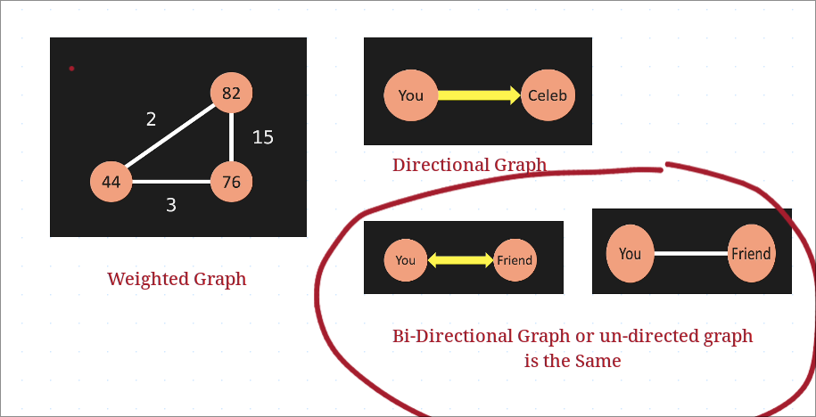
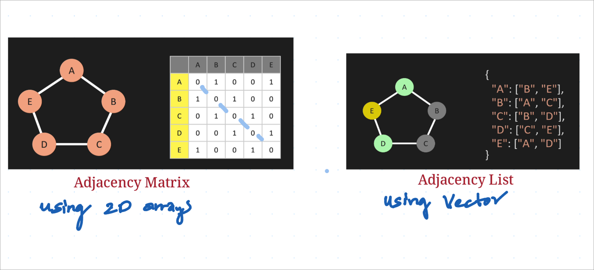
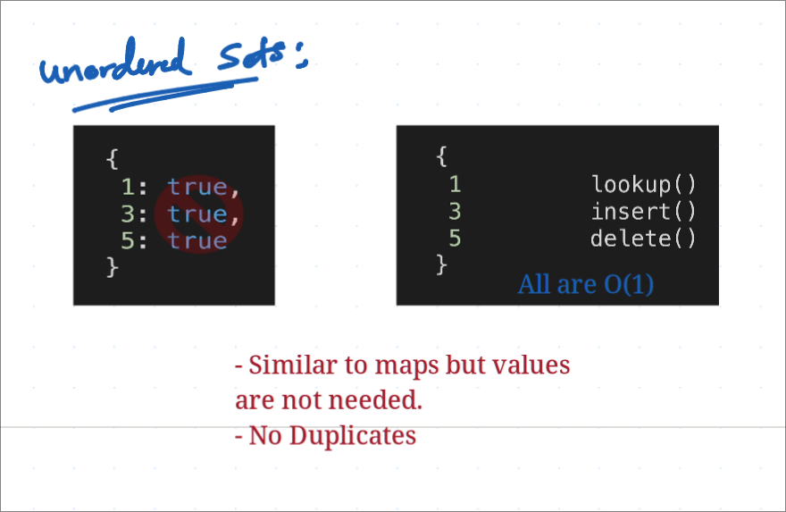
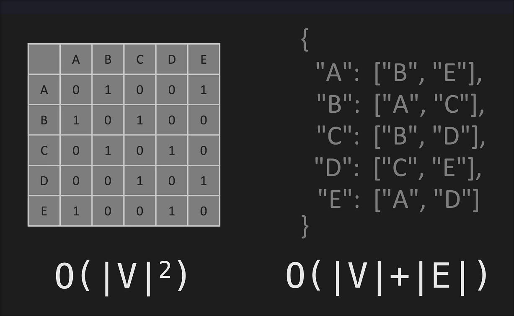
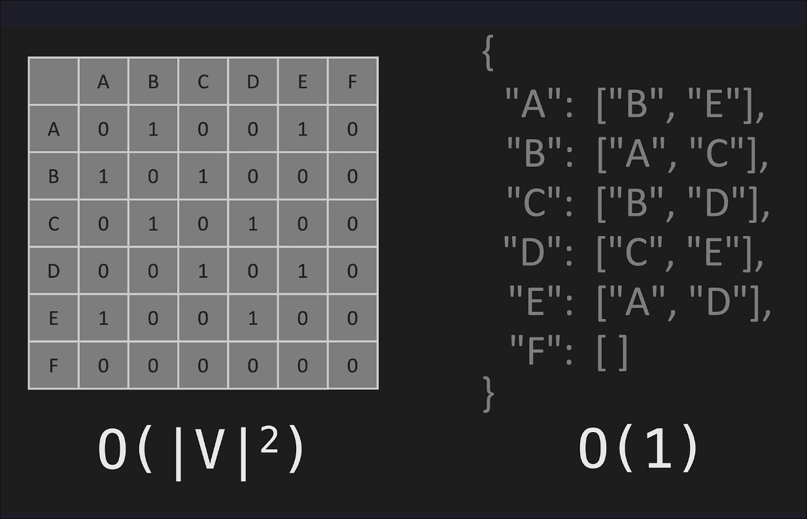

# Graphs

A graph has vertices and edges. Vertices are the nodes similar to how they were in Linked List.
Edges are the connections b/w nodes.

> We have Directed Graphs and Undirected Graphs.
Also the edges can also have weights to determine.

### Weighted Graphs:

Weighted graphs can be used for finding the shortest distance b/w two vertices.
ANother place is Network routing protocols where you want to limit the Hops,

**Bidirectional Graphs**: Example is Facebook follow. When one person follows another,

**Directional Graph**:

You are following a celebrity but they are not following back.

> Linked List is a form of tree and tree is a form of graphs. Therefore, LinkedLists are a form of graphs.

We represent graphs in two ways:

1. Adjacency Matrix - Better to use for Large edges
2. Adjacency List - Better to use for Large Vertices

### Adjacency Matrix

We always create a 2D array, where the rows and columns correspond to the vertices of a graph, and the values within the matrix indicate the presence or absence of edges between those vertices.
Instead of storing `1` in the fields, we can also store weights when dealing with Weighted Graphs for Edges.

We store the values based on the type of graph(directional or undirected).

### Adjacency List

We use Vectors here. See the Image

### Unordered Sets

Using sets to store the adjaceny list.
- They are similar to `Maps` but they don't have any values
- **Sets don't allow duplicates**

## Big O

**Space Complexity:**

Time Complexity:

### Operations

| Operation       | Adjacency Matrix | Adjacency List |
|-----------------|------------------|----------------|
| Add Vertex      | O(V^2)           | O(1)           |
| Add Edge        | O(1)             | O(1)           |
| Remove Edge     | O(1)             | O(|V|) or O(1) |
| Remove Vertex   | O(|V^2|)           | O(|V|)       |
| Check Edge      | O(1)             | O(|V|)         |

Removing Vertex needs all other Vertices doesn't have connections to that specific vertex. So, Matrix take O(n^2).
