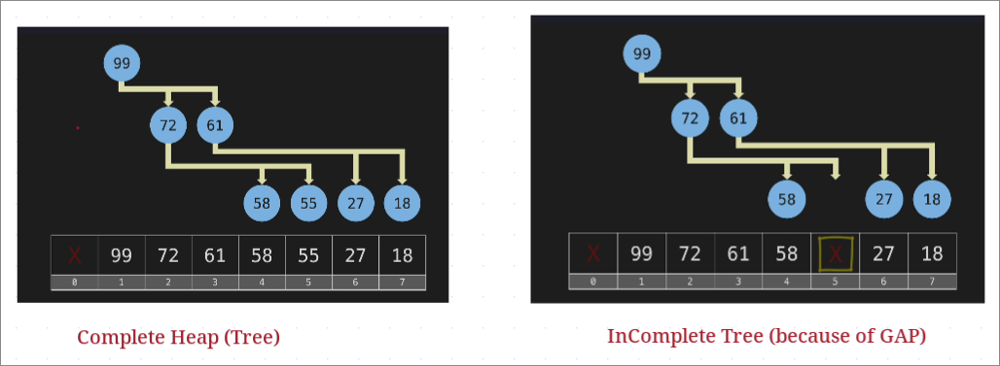
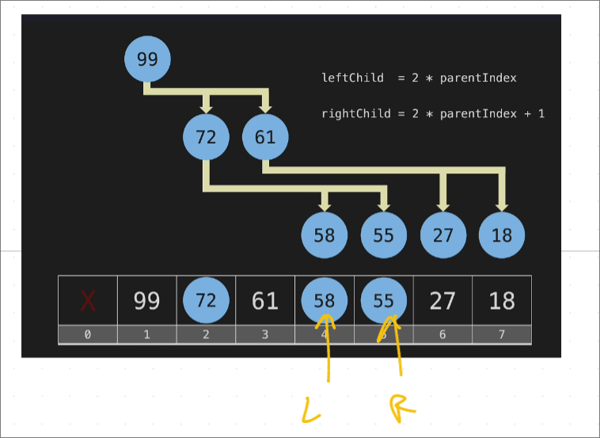
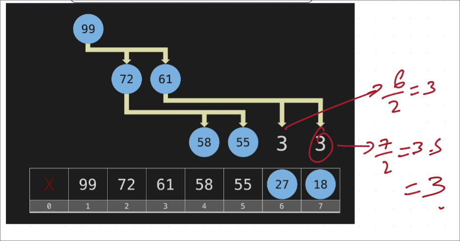
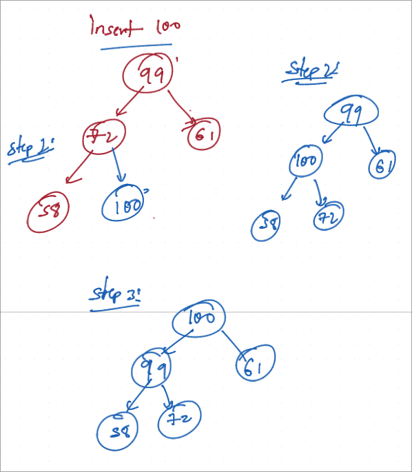

# Heap

It is a complete graph.

NOTE: Heap allows duplicates values unline BST which doesn't

**MAX HEAP**: Max value is at TOP
**MIN HEAP**: Minimum Value is at the TOP.

> There is no particular order here, except the Max value or Min value is at the top based on the type of Heap.
> We can keep it in such a way that Each Node is greater than its descendant(child nodes).

### Implementation
We can use Vector Array to store the HEAP.

**Two common ways to implement heaps**:

1. Fill the Array[0] with values
2. Leave Array[0] empty and fill the next values.

### To Calculate the left child and right child

1. **Left Child** = 2 * parentIndex
2. **Right Child** = 2 * parentIndex + 1

### Finding the Parent of the child:

Take index and do integer division by 2

### Insertion to Heap

Inserting 100:

### Remove an Item:

With Heap, we can only remove one item that is at the top.
After removing, we need to rearrange the tree.

Steps:
1. After removing, top, we need to make the tree complete.
2. Take the last node to the top (the only way)
3. Now, we need to check the Top's node with its children and replace with the higher one and redo that until we balance the tree.

### Priority Queues

We can use Heap for implementing priority queue.

In a priority queue, we always have the highest value item returned next.

> If we use array or linkedlist, the returning value would always be O(n). So, we can use Heap for better performance which is O(1)

> It's a great solution, if we have a balanced BST. But problem is, it is not always balanced(if we have all child nodes on one side only).

> So, Heap is a great way of implementing Priority Queues. Complexity is O(log n), much better than any other implementations.

### Big O

Inserting or removing an element in a priority Queue is `O(log n)`.
