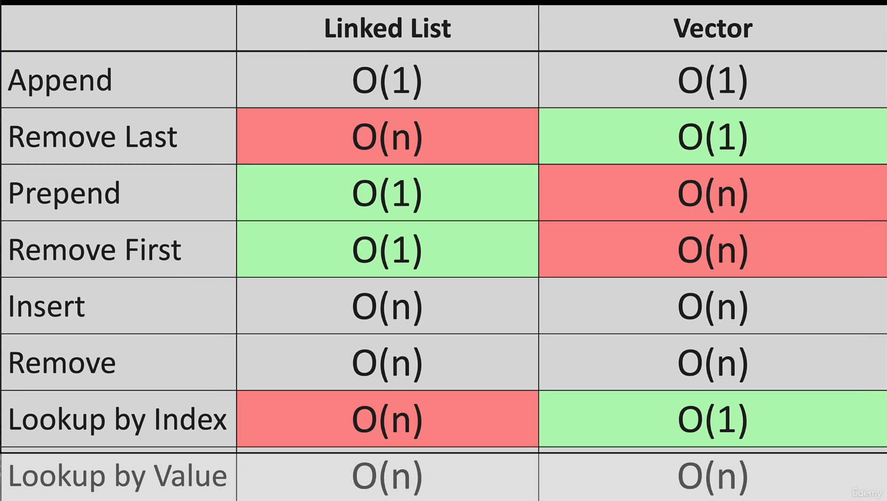
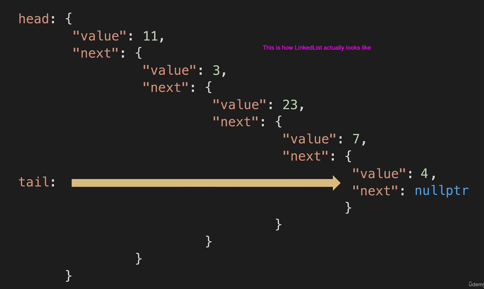

### Linked Lists

- Adding a new node at the beginning of LL is O(1)
- Adding/Removing a new node at the end of LL is O(n)
- Adding/Removing node to the middle somewhere:
  - Takes O(n)




### Under the Hood

> A Node has both value and pointer


```cpp
{
    "value": 4;
    "next": nullptr;
}
```

### How Linked List Actually Looks Like

