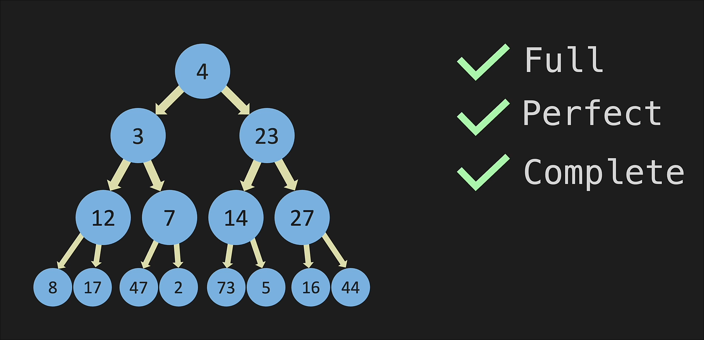
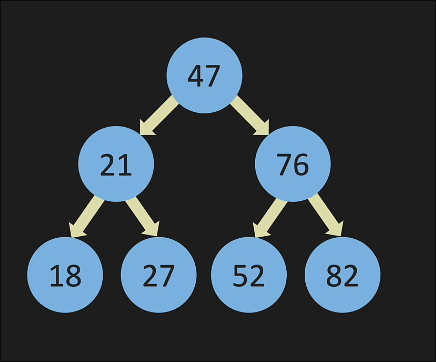

# Tree

### Binary Tree:
Binary tree has two nodes only - left, right;

- A `full tree` either has 0 or 2 nodes
- A `perfect tree` is a full tree where all leaves are at the same level
- A `complete tree` is a tree where all levels are filled except possibly the last level, which is filled from left to right.

> NOTE: Every child node can only have one parent node.

### Binary Search Tree:

A binary search tree is a binary tree where the left child contains only nodes with values less than the parent node, and the right child only contains nodes with values greater than the parent node.

### Binary Search Tree - Big O:

Check the PDF for the Big O of BST operations.

In the worst case, a BST can be skewed, which will make the tree behave like a linked list. In this case, the time complexity of operations will be O(n).
Normally, the time complexity of operations in a BST is O(log n).

insertion: O(log n)
search: O(log n)
deletion: O(log n)
